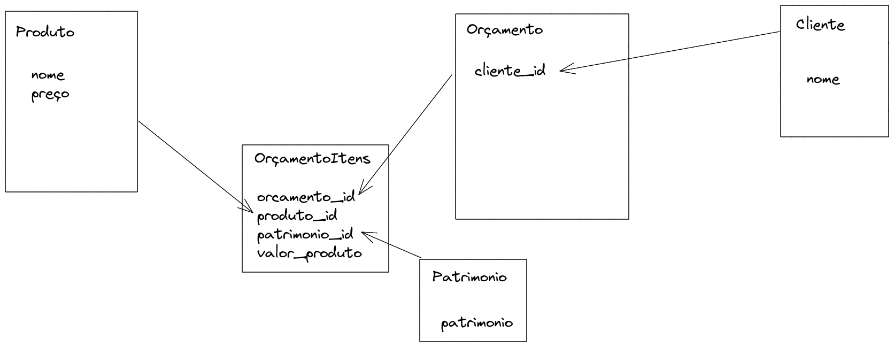
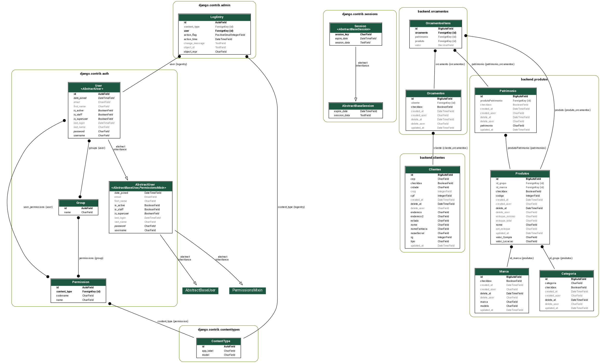
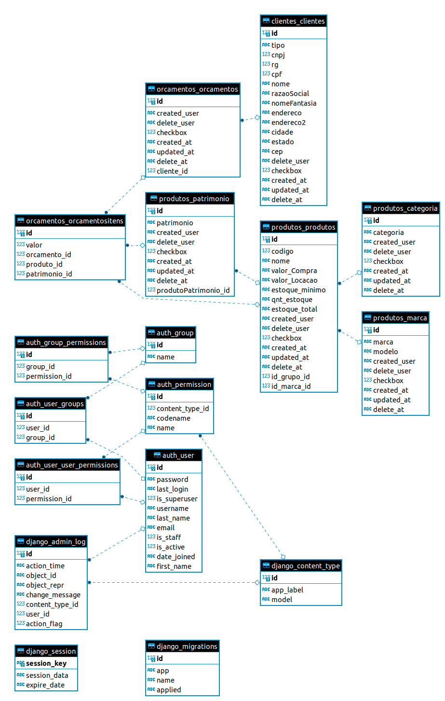

# Locadora

Projeto para Locadora de ferramentas TCC.


Este projeto foi feito com:

* Python 3.9.8
* Django 4.0
* Bootstrap 4.0
* htmx


## Como rodar o projeto?

* Clone esse repositório.
* Crie um virtualenv com Python 3.
* Ative o virtualenv.
* Instale as dependências.
* Rode as migrações.


```
git clone https://github.com/washingtonnuness/Locadora-de-Ferramentas.git
cd exame-inline
python -m venv .venv
source .venv/bin/activate
pip install -r requirements.txt
python contrib/env_gen.py
python manage.py migrate
python manage.py createsuperuser --username="admin" --email=""
python manage.py seed cliente --number=10
python manage.py seed fornecedor --number=10
python manage.py seed orcamento --number=10
python manage.py corrige_dados
```


## isort

```
isort -m 3 *
```

## Modelagem





https://www.dicas-de-django.com.br/36-django-visualizando-seus-modelos-com-graph-models



